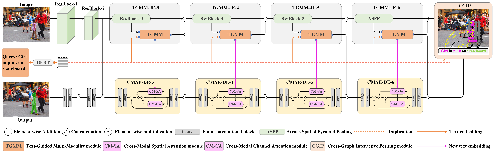

# CMIRNet: Cross-Modal Interactive Reasoning Network for Referring Image Segmentation

Welcome to the official repository for the paper "CMIRNet: Cross-Modal Interactive Reasoning Network for Referring Image Segmentation", IEEE TCSVT, 2024. 

### The Initialization Weights for Training
Download pre-trained classification weights of the [ResNet-50](https://download.pytorch.org/models/resnet50-19c8e357.pth), [ResNet-101](https://download.pytorch.org/models/resnet101-5d3b4d8f.pth), [Swin-Transformer-Base](https://github.com/SwinTransformer/storage/releases/download/v1.0.0/swin_base_patch4_window12_384_22k.pth) and [Swin-Transformer-Large](https://github.com/SwinTransformer/storage/releases/download/v1.0.0/swin_large_patch4_window12_384_22k.pth), and place the ` .pth ` files in ` ./pretrained ` directory. These weights are essential for initializing the model during training.

### Trained Weights of CMIRNet for Testing

[Download](https://pan.baidu.com/***)

### Dataset

Download images from [COCO](https://cocodataset.org/#download). Please use the first downloading link *2014 Train images [83K/13GB]*, and extract the downloaded `train_2014.zip` file to `./data/images/`.
We used our method for referring image segmentation with RefCOCO, RefCOCO+, RefCOCOg and RefCLEF. Both datasets can be downloaded in the [official site](https://github.com/lichengunc/refer).

### Train
Please download the pre-trained model weights and train CMIRNet using the following commands.

~~~python
python train_resnet.py --model_id cmirnet_refcoco_res --device cuda:0

python train_resnet.py --model_id cmirnet_refcocop_res --device cuda:0 --dataset refcoco+

python train_resnet.py --model_id cmirnet_refcocog_res --device cuda:0 --dataset refcocog --splitBy umd

python train_swin.py --model_id cmirnet_refcoco_swin --device cuda:0

python train_swin.py --model_id cmirnet_refcocop_swin --device cuda:0 --dataset refcoco+

python train_swin.py --model_id cmirnet_refcocop_swin --device cuda:0 --dataset refcocog --splitBy umd
~~~

### Test
Download the CMIRNet model weights, create the necessary directories to store these files, and ensure that the `--resume` parameter points to the correct path.

~~~python
python test_resnet.py --device cuda:0 --resume path/to/weights

python test_resnet.py --device cuda:0 --resume path/to/weights --dataset refcoco+

python test_resnet.py --device cuda:0 --resume path/to/weights --dataset refcocog --splitBy umd

python test_swin.py --device cuda:0 --resume path/to/weights  --window12

python test_swin.py --device cuda:0 --resume path/to/weights --dataset refcoco+ --window12

python test_swin.py --device cuda:0 --resume path/to/weights --dataset refcocog --splitBy umd --window12
~~~

### Citation

If it helps your research,  please use the information below to cite our work, thank you. 

~~~
@ARTICLE{

}
~~~
